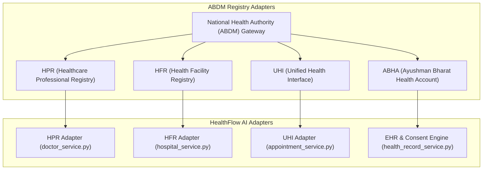

# HealthFlow AI — Ayushman Bharat Digital Mission (ABDM) Integration Guide

HealthFlow AI natively integrates with India's National Digital Health Ecosystem across four primary building blocks:

## 1. Healthcare Professional Registry (HPR)
- Integration adapter: `backend/app/integrations/abdm/hpr_adapter.py`
- Verifies doctor registration numbers, qualifications (MCI / State Medical Council), and specialties.

## 2. Health Facility Registry (HFR)
- Integration adapter: `backend/app/integrations/abdm/hfr_adapter.py`
- Verifies hospital registration numbers, facility type, emergency trauma services, and empaneled schemes.

## 3. Unified Health Interface (UHI)
- Integration adapter: `backend/app/integrations/abdm/uhi_adapter.py`
- Implements Beckn/UHI protocol discovery, slot lookup, booking, cancellation, and status callbacks.
