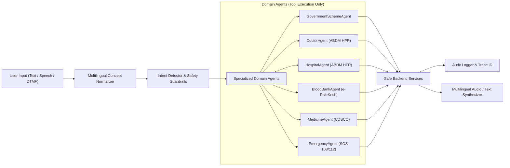

# HealthFlow AI — AI Agents & Tool Calling Engine

## 1. Orchestration Architecture
The HealthFlow AI Orchestrator (`backend/app/ai/orchestrator.py`) acts as the central coordinator for natural language queries across web, mobile, voice, and telephony.

## 2. Strict Healthcare Safety Guardrails
1. **Zero Database Mutations via LLM**: Agents cannot directly modify Firestore collections. Every state change requires explicit service layer validation.
2. **Deterministic Rules Over Prompting**: Government scheme eligibility is computed by the deterministic rules engine (`scheme_service.py`), not by LLM hallucination.
3. **Emergency Priority Triage**: Emergency keywords ("accident", "chest pain", "breathing difficulty", "108") bypass conversational workflows and immediately trigger the SOS protocol.
4. **Authoritative Attribution**: Every AI output citing healthcare information references the verified database provenance and verification timestamp.
