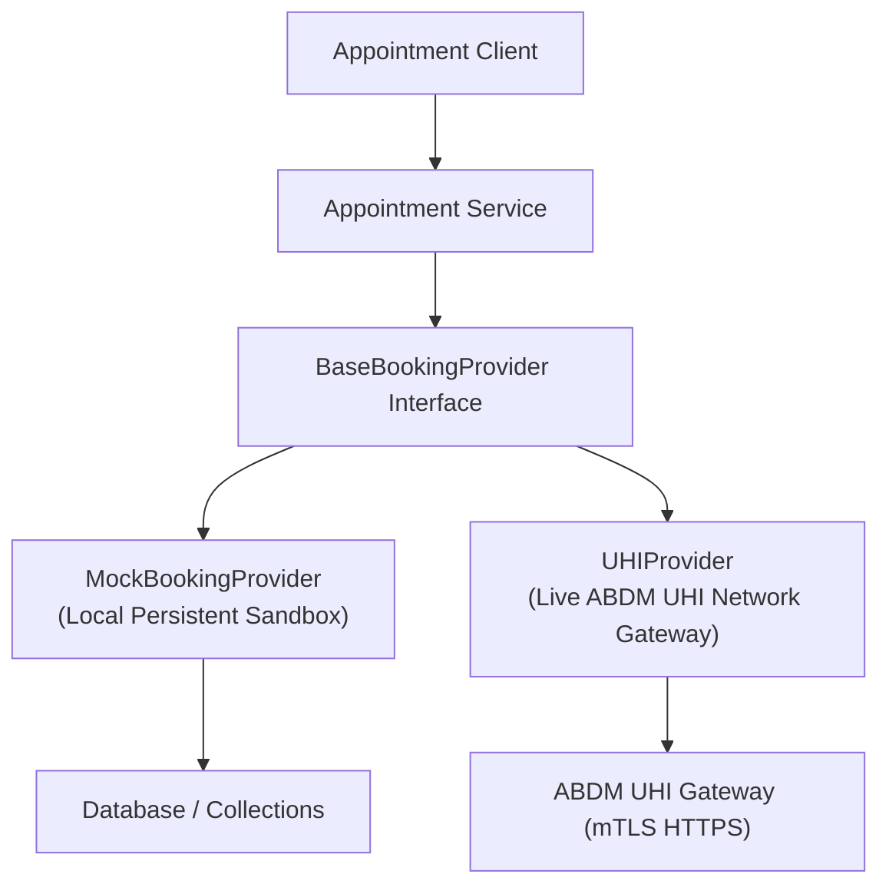

# HealthFlow AI — Online Appointment Booking & UHI Integration

## 1. ABDM Unified Health Interface (UHI) Booking Adapter
HealthFlow AI implements the **Adapter Pattern** for healthcare appointment scheduling, making the backend seamlessly interchangeable between local development sandboxes and national UHI network gateways.

## 2. Booking Lifecycle
1. **Search & Slot Query**: Retrieve available OPD and Teleconsultation slots for ABDM HPR registered doctors.
2. **Reservation & Confirmation**: Reserve slot with patient ABHA address / phone. UHI reference token issued (`UHI-IN-*`).
3. **Reschedule / Cancellation**: Modify slot or cancel with audit trail reason.
4. **No False Confirmations**: The UI never presents an appointment as confirmed unless certified by the provider interface.
