# HealthFlow AI — System Architecture

## 1. Architectural Philosophy
HealthFlow AI is architected using **Clean Architecture**, **Domain-Driven Design (DDD)**, and **SOLID principles**. The architecture ensures strict separation of concerns, complete testability, and decoupled external dependencies through the **Repository & Adapter Pattern**.

```mermaid
graph TD
    subgraph "Clients & Telephony"
        WebClient["Web / Mobile Browser (React/Vite)"]
        VoiceMic["Multilingual Web Speech Client"]
        PhoneCaller["Feature Phone (Telephony Carrier Ingress)"]
        Scanner["Secure QR Scanner"]
    end

    subgraph "Ingress & Gateway Layer"
        FastAPI["FastAPI App Gateway (/api/v1)"]
        CORS["CORS & Request Timing Middleware"]
        AuthMiddleware["JWT Authentication & RBAC Guard"]
        AuditMiddleware["Immutable Audit Logger"]
    end

    subgraph "Domain Service Layer"
        SchemeService["Scheme & Eligibility Rules Engine"]
        PrescriptionService["Prescription OCR & Normalization Pipeline"]
        MedicineService["Medicine Intelligence Database"]
        QRService["Signed Ephemeral QR Token Resolver"]
        EHRService["Digital Health Record & Consent Engine"]
        DoctorService["Doctor Discovery (ABDM HPR)"]
        HospitalService["Hospital Discovery (ABDM HFR)"]
        AppointmentService["Appointment Booking (ABDM UHI)"]
        BloodBankService["Blood Bank Inventory (e-RaktKosh)"]
        VoiceService["Voice Assistant Orchestrator"]
        TelephonyService["Telephony IVR & Voice PIN Guard"]
        ReminderService["Medication Reminder Scheduler"]
        EmergencyService["Emergency SOS Responder"]
        IngestionService["Data Ingestion & Provenance Engine"]
    end

    subgraph "Integration Adapters"
        HPRAdapter["ABDM HPR Adapter (Mock / Gateway)"]
        HFRAdapter["ABDM HFR Adapter (Mock / Gateway)"]
        UHIAdapter["ABDM UHI Adapter (Mock / Gateway)"]
        eRaktKoshAdapter["e-RaktKosh Blood Bank Adapter"]
        TelephonyAdapter["Telephony Provider (Twilio/Exotel/Mock)"]
    end

    subgraph "Persistence Layer"
        FirestoreClient["Firestore Client Factory"]
        MockFirestore["Local Persistent JSON Database"]
        LiveFirestore["Google Cloud Firestore"]
    end

    WebClient --> FastAPI
    VoiceMic --> FastAPI
    PhoneCaller --> FastAPI
    Scanner --> FastAPI

    FastAPI --> CORS --> AuthMiddleware --> AuditMiddleware

    AuditMiddleware --> SchemeService
    AuditMiddleware --> PrescriptionService
    AuditMiddleware --> MedicineService
    AuditMiddleware --> QRService
    AuditMiddleware --> EHRService
    AuditMiddleware --> DoctorService
    AuditMiddleware --> HospitalService
    AuditMiddleware --> AppointmentService
    AuditMiddleware --> BloodBankService
    AuditMiddleware --> VoiceService
    AuditMiddleware --> TelephonyService
    AuditMiddleware --> ReminderService
    AuditMiddleware --> EmergencyService
    AuditMiddleware --> IngestionService

    DoctorService --> HPRAdapter
    HospitalService --> HFRAdapter
    AppointmentService --> UHIAdapter
    BloodBankService --> eRaktKoshAdapter
    TelephonyService --> TelephonyAdapter

    SchemeService --> FirestoreClient
    PrescriptionService --> FirestoreClient
    MedicineService --> FirestoreClient
    EHRService --> FirestoreClient
    FirestoreClient --> MockFirestore
    FirestoreClient --> LiveFirestore
```

## 2. Layered Responsibilities
1. **API Layer (`backend/app/api/v1/`)**: Exposes REST endpoints, validates request payloads with Pydantic v2 schemas, handles dependency injection, and maps domain exceptions to HTTP status codes.
2. **Domain Service Layer (`backend/app/services/`)**: Implements pure business logic, rules engine computations, confidence evaluation, and cryptographic token signing.
3. **Integration Layer (`backend/app/integrations/`)**: Implements provider interfaces with interchangeable mock sandboxes and live gateway connections for ABDM (HPR, HFR, UHI), e-RaktKosh, and Telephony.
4. **Persistence Layer (`backend/app/db/`)**: Abstracts document database operations. When cloud credentials are absent, runs the file-persistent JSON Mock Firestore engine without any functional compromise.
