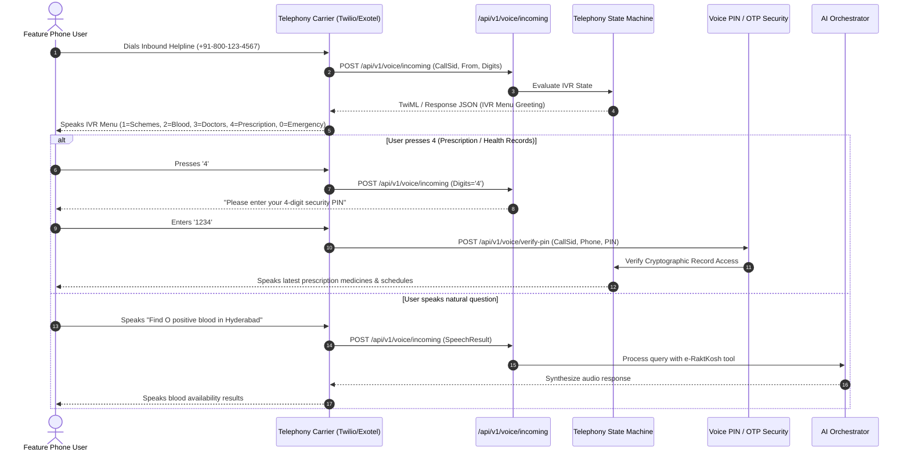

# HealthFlow AI — Phone Call & Telephony AI Architecture

## 1. Feature Phone Ingress Architecture
For users without smartphones or internet access, HealthFlow AI provides complete IVR and voice-agent interaction over standard cellular phone calls.

## 2. Voice Security Guardrails
- **Zero Raw PII Disclosure**: Medical history, Aadhaar numbers, or full prescription lists are never read out merely because a caller knows a phone number.
- **Mandatory Voice PIN / OTP**: Access to prescription records requires entering a pre-configured 4-digit security PIN.
- **Audit Trails**: Every call, IVR transition, failed PIN attempt, and disclosure event is recorded in the immutable compliance audit log.
