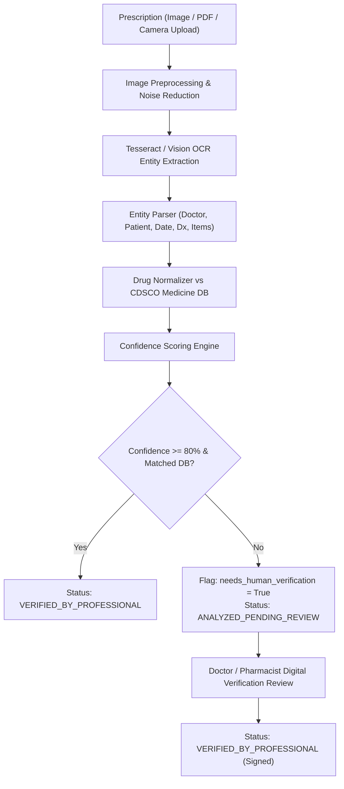

# HealthFlow AI — Prescription Analysis, OCR & Human-in-the-Loop Verification

## 1. Analysis Pipeline

## 2. Safety Principles
1. **Never Silently Modify Doctor Orders**: All extracted dosages, frequencies, and instructions preserve original text and are linked to normalized generic compositions.
2. **Confidence Score Transparency**: Every item displays an explicit OCR confidence score (0.0 - 1.0).
3. **Mandatory Human-in-the-Loop**: Any item with confidence below 80% or ambiguous handwriting requires professional human verification before dispensing.
