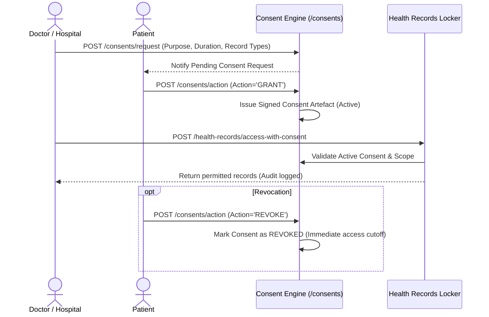

# HealthFlow AI — Privacy, Patient Consent & Data Governance

## 1. Patient-Controlled Consent Architecture
In compliance with ABDM and India's Digital Personal Data Protection (DPDP) Act, patients maintain absolute sovereignty over their health data.

## 2. Granular Consent Controls
- **Time-Bound**: Consents expire automatically after the designated window (1 to 720 hours).
- **Purpose-Bound**: Limited to specific purposes (e.g. "Cardiology OPD Review", "Emergency Care", "Pharmacy Dispensation").
- **Type-Bound**: Patients can restrict access to specific document categories (e.g. Diagnostic Summaries only, excluding mental health or private notes).
