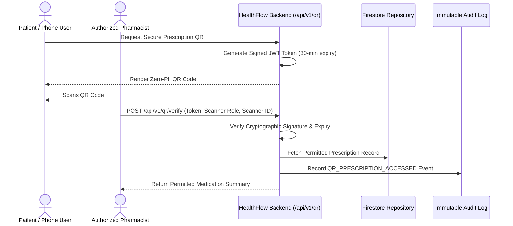

# HealthFlow AI — Secure QR Digital Prescription Architecture

## 1. Zero-PII Cryptographic Principle
Standard QR codes that embed patient names, medical diagnoses, or drug lists present severe privacy and eavesdropping risks. 

**HealthFlow AI mandates that QR codes contain ZERO Protected Health Information (PHI/PII)**.

### QR Code Payload Structure
The QR code encodes strictly an encrypted, signed JWT token:
```json
{
  "prescription_id": "rx_f4ef512902",
  "patient_id": "patient_ravi_kumar",
  "doctor_id": "doc_ramesh_varma",
  "exp": 1787163000,
  "iat": 1787161200,
  "type": "secure_qr_prescription",
  "iss": "healthflow-ai"
}
```



## 2. Compliance & Expiration
- QR tokens expire automatically after 30 minutes (configurable via `QR_TOKEN_EXPIRE_MINUTES`).
- Every scan attempt (successful or rejected) creates an immutable compliance audit record.
