# HealthFlow AI — Multilingual Voice AI Architecture

## 1. Multilingual Pipeline
HealthFlow AI supports low-literacy users through direct vernacular voice communication.

```mermaid
graph LR
    VoiceIn["User Voice Input (Web Speech API)"] --> ASR["Speech-to-Text Recognition"]
    ASR --> ConceptNorm["Concept Normalization (EN / TE / HI)"]
    ConceptNorm --> AIOrchestrator["AI Orchestrator & Tool Caller"]
    AIOrchestrator --> BackendAPI["HealthFlow Safe Backend API"]
    BackendAPI --> ResponseGen["Multilingual Response Generator"]
    ResponseGen --> TTS["Text-to-Speech Audio Synthesis (Web Audio)"]
    TTS --> UserEar["Audio Playback to User"]
```

## 2. Supported Languages & Extensibility
- **Telugu (`తెలుగు`)**: `te-IN`
- **Hindi (`हिन्दी`)**: `hi-IN`
- **English**: `en-IN` / `en-US`
- **Extensible Language Map**: Tamil (`ta`), Kannada (`kn`), Malayalam (`ml`), Marathi (`mr`), Bengali (`bn`), Gujarati (`gu`), Punjabi (`pa`), Odia (`or`).

The multilingual normalization engine decouples the user's spoken vernacular phrasing from canonical medical concepts (e.g. mapping "ఆరోగ్యశ్రీ" -> "aarogyasri", "రక్తం" -> "blood", "షుగర్" -> "diabetes"), ensuring deterministic clinical execution.
